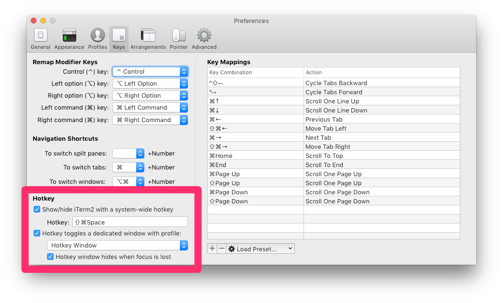
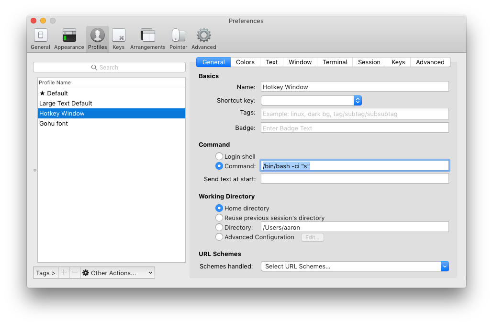

# fzfOS - Spotlight for the terminal but with fzf

Spotlight for the terminal, but better...

##Current Features:
- App launching/switching
- Chrome tab switching
- Music searching (limited to spotify, see note below)
- Filesystem find files/directories (space will preview without opening)

##Desired Features:
- Open window switching? ie. fuzzy find open word docs, virtualbox VMs etc
- Browser tab switching (firefox, safari, IE)
- Music searching: itunes, other major media players

## Install
- Clone repo
- source it in your .bashrc

```
source ~/fzfOS/fzfOS.sh
```

##Usage
Run the switcher command (shortened to "s"):
```
$ s

# Then Select a launcher type by typing a, c, o, p
# Now fuzzy find whatever you want...
```

##iTerm Hotkey window
Works quite well with iTerm2's Hotkey window feature: https://www.iterm2.com/features.html#hotkey-window

First enable the Hotkey window feature in the preferences:


Then set the startup command to run the switcher:


## Spotify playlist search
Currently the way this works is a bit of a cheap hack.
```bash
alias play='cat ~/bin/spotifyplaylists-applescript.txt | fzf | osascript '
```
The play alias simply pipes a file full of applescript lines into osascript via
fzf.  This was just a quick way to get spotify playlist searching working to suit my
needs.
The spotifyplaylists-applescript.txt file looks like this:
```applescript
tell application "Spotify" to play track "https://play.spotify.com/user/spotifyaustralia/playlist/4wxxvmkuNN3W9tMObLslTJ " --The Australian Sound
tell application "Spotify" to play track "https://play.spotify.com/user/youzoun/playlist/2POsysj8dTuOCAMPYVsgeO " --Minimal // Deep House
...
```
To generate this file is a bit of a manual process.
I logged into the web client of spotify, grabbed the page source and then with
some vim magic grabbed the url and playlist name and formatted it so each line
is a valid osascript line with the playlist name in a comment on the end.
You can then search in fzf for the playlist name and it works as expected.
This means the playlist file gets out of date the second you save a new playlist.


## TODO:
- Add a gif of usage
- Write a spotify playlist scraper script to update spotifplaylists-applescript.txt
